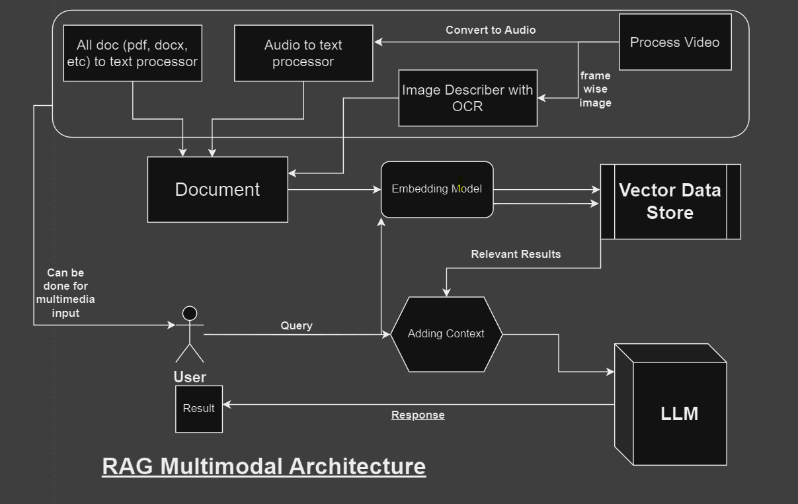

# Retrieval-Augmented Generation (RAG) Pipeline

This repository contains a comprehensive implementation of a Retrieval-Augmented Generation (RAG) pipeline. The pipeline integrates document ingestion, embeddings generation, vector storage, and GPT-based response generation. Below is a detailed guide for setting up and using the pipeline.


## Architecture Overview

The pipeline consists of the following components:

1. **Document Loaders:** Extracts text from various file types (PDF).
2. **Text Splitter:** Divides extracted data into smaller text chunks.
3. **Embedding Generator:** Converts text chunks into vector embeddings.
4. **Vector Store:** Uses Pinecone to store and retrieve embeddings.
5. **Retriever:** Fetches relevant documents based on user queries.
6. **Response Generator:** GPT-2 model generates natural language responses.
7. **Gradio Interface:** A web application to interact with the pipeline.

### Architecture Diagram


---

## Setup Instructions

### Prerequisites
1. Python 3.8 or above.
2. Pinecone account and API key.
3. HuggingFace account for pre-trained models.

### Installation

1. Clone the repository:
   ```bash
   git clone https://github.com/yourusername/rag-pipeline.git
   cd rag-pipeline
   ```

2. Install dependencies:
   ```bash
   pip install -r requirements.txt
   ```

3. Set up environment variables:
   - Create a `.env` file:
     ```
     PINECONE_API_KEY=<your-pinecone-api-key>
     ```

---

## Usage

### Data Ingestion
Place your files in the `data` directory. Supported file formats are `PDF`.


## Challenges and Extensions

### Challenges
- **Multimedia Handling:** Current implementation supports text-based documents only. Adding OCR support can enable multimedia processing.
- **Scalability:** Scaling Pinecone indexing and retrieval for larger datasets.

### Extensions
- Integrate more robust language models like GPT-4 for enhanced responses.
- Add support for multilingual document ingestion and query handling.


## Sample Data Files
Example data files are provided in the `data` directory for testing purposes.


